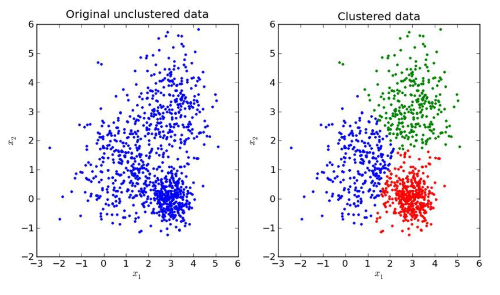
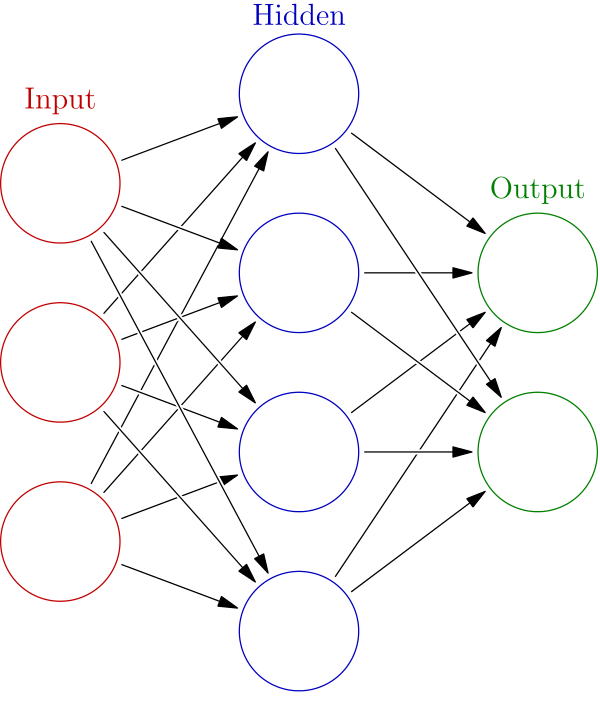
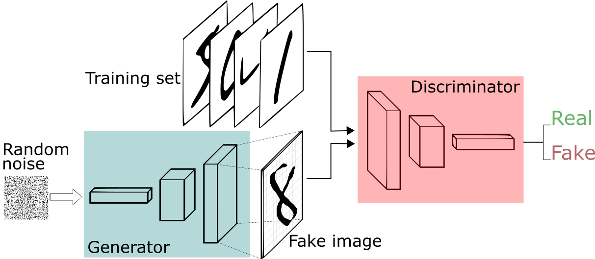
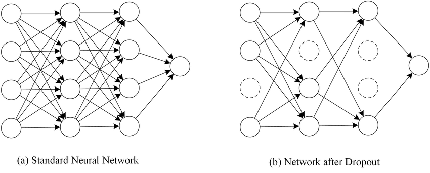
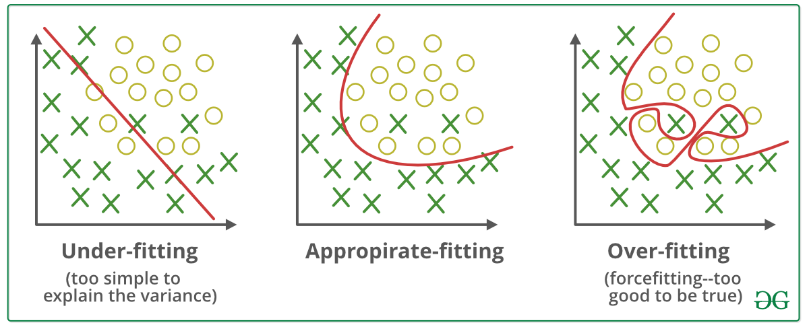
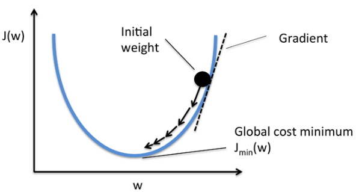
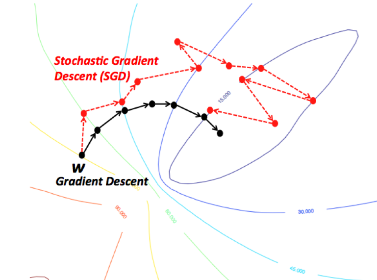
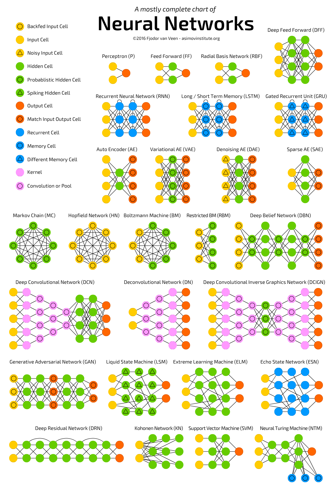

# Artificial-Intelligence-Lexical

This repository is aiming to regroup most of the definition in the field of AI. Since there is a lot of things to remember, I would advice the use of flashcard if you are new to the field.

## General terms
### Narrow/Weak Artificial Intelligence

Weak artificial intelligence (weak AI), also known as narrow AI, is artificial intelligence that is focused on one narrow task. Weak AI is defined in contrast to strong AI, a machine with the ability to apply intelligence to any problem, rather than just one specific problem, sometimes considered to require consciousness, sentience and mind). Many currently existing systems that claim to use "artificial intelligence" are likely operating as a weak AI focused on a narrowly defined specific problem.

Siri is a good example of narrow intelligence. Siri operates within a limited pre-defined range of functions. There is no genuine intelligence or no self-awareness despite being a sophisticated example of weak AI.
[Wikipedia](https://en.wikipedia.org/wiki/Weak_AI)
### Artificial General Intelligence (Strong AI/True AI)

Artificial general intelligence (AGI) is the intelligence of a machine that has the capacity to understand or learn any intellectual task that a human being can. It is a primary goal of some artificial intelligence research and a common topic in science fiction and future studies. Some researchers refer to Artificial general intelligence as "strong AI", "full AI" or as the ability of a machine to perform "general intelligent action"; others reserve "strong AI" for machines capable of experiencing consciousness.

Some references emphasize a distinction between strong AI and "applied AI" (also called "narrow AI" or "weak AI"): the use of software to study or accomplish specific problem solving or reasoning tasks. Weak AI, in contrast to strong AI, does not attempt to perform the full range of human cognitive abilities.
[Wikipedia](https://en.wikipedia.org/wiki/Artificial_general_intelligence)

On a side note, here is the 3 theory of consciousness that are taken seriously by the neurology community:
- [global workspace theory](https://en.wikipedia.org/wiki/Global_workspace_theory)
- biological theory of consciousness
- [Higher order theory of consciousness](https://en.wikipedia.org/wiki/Higher-order_theories_of_consciousness)

_________
## Categories of machine learning

### Unsupervised Learning
Unsupervised learning is a type of self-organized Hebbian learning that helps find previously unknown patterns in data set without pre-existing labels. It is also known as self-organization and allows modeling probability densities of given inputs. It is one of the main three categories of machine learning, along with supervised and reinforcement learning. Semi-supervised learning has also been described, and is a hybridization of supervised and unsupervised techniques.
[Wikipedia](https://en.wikipedia.org/wiki/Unsupervised_learning)

### Supervised Learning
Supervised learning is the machine learning task of learning a function that maps an input to an output based on example input-output pairs. It infers a function from labelled training data consisting of a set of training examples. In supervised learning, each example is a pair consisting of an input object (typically a vector) and a desired output value (also called the supervisory signal). A supervised learning algorithm analyses the training data and produces an inferred function, which can be used for mapping new examples. An optimal scenario will allow for the algorithm to correctly determine the class labels for unseen instances. This requires the learning algorithm to generalize from the training data to unseen situations in a "reasonable" way (see inductive bias).

The parallel task in human and animal psychology is often referred to as concept learning.
[Wikipedia](https://en.wikipedia.org/wiki/Supervised_learning)
______
## Architectures
### ANN (Artificial Neural Network)
Artificial neural networks (ANN) or connectionist systems are computing systems that are inspired by, but not necessarily identical to, the biological neural networks that constitute animal brains. Such systems "learn" to perform tasks by considering examples, generally without being programmed with any task-specific rules. For example, in image recognition, they might learn to identify images that contain cats by analysing example images that have been manually labelled as "cat" or "no cat" and using the results to identify cats in other images. They do this without any prior knowledge about cats, for example, that they have fur, tails, whiskers and cat-like faces. Instead, they automatically generate identifying characteristics from the learning material that they process.

An ANN is based on a collection of connected units or nodes called artificial neurons, which loosely model the neurons in a biological brain. Each connection, like the synapses in a biological brain, can transmit a signal from one artificial neuron to another. An artificial neuron that receives a signal can process it and then signal additional artificial neurons connected to it.

### Perceptron

- Category : Supervised learning

The perceptron is one of the very first algorithms of machine learning, and the most simple artificial neural network.

### MLP (Multilayer Perceptron)

[Good video explanation](https://www.youtube.com/watch?v=u5GAVdLQyIg)
### Radial Basis Function Network

### CNN (Convolutional Neural Network)
#### Padding
#### Max pooling
#### Average pooling

### Boltzmann Machine Network
- Category : unsupervised machine learning
### RNN (Recurrent Neural Network)

What is a recurrent neural network ?
- A recurrent neural network use the weight of the previous occurrence.

How does it work exactly ?
- During the forward propagation the weight of the hidden layer are the one from the previous layer.

Note: Stochastic gradient descent apparently don't work well with RNN
#### LSTM (Long Short Term Memory)

[Wikipedia](https://en.wikipedia.org/wiki/Long_short-term_memory) |
[The paper](https://www.bioinf.jku.at/publications/older/2604.pdf)

#### Hopfield network
- Category : unsupervised machine learning
The Hopfield network is an [Auto-associative Memory Network](https://en.wikipedia.org/wiki/Autoassociative_memory)

### GAN (Generative adversarial network)

[paper](https://arxiv.org/pdf/1406.2661.pdf)

## Layers
________
## Activation function

### Cross Validation

### Regularisation

### Dropout
**i.e** Dropout is a method that allow you to "turn off" some of the neurones randomly. the most common dropout probability for a layer is 0.5 but it can be tune at will.

### Overfitting (high variance) and Underfitting (High bias)

## gradient descent

## stochastic gradient descent
In both gradient descent (GD) and stochastic gradient descent (SGD), you update a set of parameters in an iterative manner to minimize an error function.

While in GD, you have to run through ALL the samples in your training set to do a single update for a parameter in a particular iteration, in SGD, on the other hand, you use ONLY ONE or SUBSET of training sample from your training set to do the update for a parameter in a particular iteration. If you use SUBSET, it is called Minibatch Stochastic gradient Descent.

Thus, if the number of training samples are large, in fact very large, then using gradient descent may take too long because in every iteration when you are updating the values of the parameters, you are running through the complete training set. On the other hand, using SGD will be faster because you use only one training sample and it starts improving itself right away from the first sample.

SGD often converges much faster compared to GD but the error function is not as well minimized as in the case of GD. Often in most cases, the close approximation that you get in SGD for the parameter values are enough because they reach the optimal values and keep oscillating there.

If you need an example of this with a practical case, check Andrew NG's notes here where he clearly shows you the steps involved in both the cases. cs229-notes
[source](https://datascience.stackexchange.com/questions/36450/what-is-the-difference-between-gradient-descent-and-stochastic-gradient-descent)
______________________________

## Mini-batch gradient descent

# Conclusion

https://towardsdatascience.com/the-mostly-complete-chart-of-neural-networks-explained-3fb6f2367464
# other
autoML

# Question

* Whet is the difference between Artificial Neural Network and deep learning?
  

  
Answer

  

* ?
  

  
Answer

  

